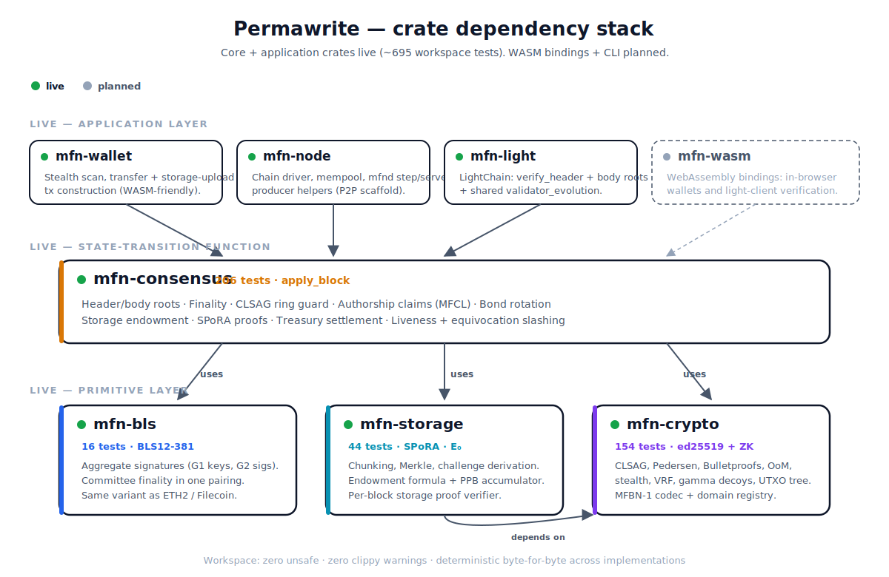
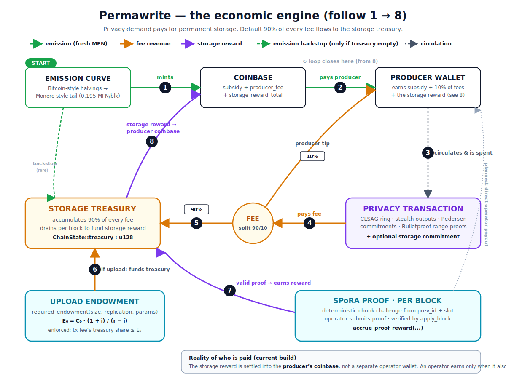

<div align="center">

# Permawrite

**A privacy-preserving, permanent-storage blockchain.**

*Monero-grade financial privacy fused with greater-than-Arweave-grade data permanence — in a single chain.*

[](#status)
[](#design-philosophy)
[](#design-philosophy)
[](#license)

[**Read the overview →**](./docs/OVERVIEW.md) &nbsp;·&nbsp; [**Read the architecture →**](./docs/ARCHITECTURE.md) &nbsp;·&nbsp; [**Privacy & permanence (why one network) →**](./docs/PRIVACY_AND_PERMANENCE.md) &nbsp;·&nbsp; [**Roadmap →**](./docs/ROADMAP.md)

</div>

---

## What this is

Permawrite is the **reference Rust implementation** of a new layer-1 blockchain (internally codenamed **MoneyFund Network**, MFBN-1 on the wire) that fuses two things which currently exist only in separate chains:

1. **Financial privacy at least as strong as Monero** — confidential amounts, stealth addresses, decoy-based ring signatures with deniable spending, no public address book, no visible balances.
2. **Data permanence at least as strong as Arweave** — content-addressed uploads anchored on-chain with an upfront endowment that funds storage operators forever, audited every block via succinct random-access proofs.

These two halves aren't bolted together. They **share the economics**: the priority fees paid by privacy transactions flow into the same treasury that funds permanent storage. **Financial privacy is what pays for permanent storage.** Every confidential transaction subsidizes the network's promise to keep data alive in perpetuity.

The full vision and the design rationale live in [**docs/OVERVIEW.md**](./docs/OVERVIEW.md). The whitepaper-grade technical spec lives in [**docs/ARCHITECTURE.md**](./docs/ARCHITECTURE.md).

<p align="center">
  
</p>

---

## Documentation map

Three reading paths depending on what you want:

### 🧭 I want to understand what this is

Start here. Plain-language framing for someone who's smart but doesn't want to read formulas yet.

- [**docs/OVERVIEW.md**](./docs/OVERVIEW.md) — the project, the vision, why it's hard, how it works (intuition only, no math)
- [**docs/PRIVACY_AND_PERMANENCE.md**](./docs/PRIVACY_AND_PERMANENCE.md) — why privacy and permanence are fused here (freedom, incentives, economics)
- [**docs/GLOSSARY.md**](./docs/GLOSSARY.md) — every acronym and term used anywhere in the docs

### 🧮 I want the technical design

Whitepaper-grade specifications. Math, wire formats, hash domains, derivations.

- [**docs/ARCHITECTURE.md**](./docs/ARCHITECTURE.md) — system-wide architecture: layers, data flow, state-transition function
- [**docs/PRIVACY.md**](./docs/PRIVACY.md) — the privacy half: stealth addresses, Pedersen commitments, CLSAG ring signatures, Bulletproof range proofs, decoy selection, the Tier-1/2/3/4 anonymity progression
- [**docs/STORAGE.md**](./docs/STORAGE.md) — the permanence half: chunking, Merkle commitment, SPoRA per-block challenges, endowment math, the PPB-precision yield accumulator
- [**docs/CONSENSUS.md**](./docs/CONSENSUS.md) — the consensus engine: slot-based PoS, stake-weighted VRF leader election, BLS12-381 committee finality, equivocation slashing, liveness slashing
- [**docs/ECONOMICS.md**](./docs/ECONOMICS.md) — hybrid emission, two-sided fee split, treasury settlement, the `E₀ = C₀·(1+i)/(r−i)` permanence derivation

### 🛠 I want to build / contribute

- [**CONTRIBUTING.md**](./CONTRIBUTING.md) — how to set up, what conventions to follow, how the test gate works
- [**CODEBASE_STATS.md**](./CODEBASE_STATS.md) — auto-generated line counts / file breakdown (regenerate via `node scripts/codebase-stats.mjs`)
- [**PORTING.md**](./PORTING.md) — TypeScript reference → Rust port tracker; one row per module
- [**SECURITY.md**](./SECURITY.md) — vulnerability disclosure
- [**docs/ROADMAP.md**](./docs/ROADMAP.md) — what's live, what's next, the tier-by-tier rollout

### 📦 I want a specific crate

Each crate has its own README with public API summary, test counts, and links into the deep-dive docs.

- [**`mfn-crypto`**](./mfn-crypto/README.md) — ed25519 + ZK primitives (Schnorr, Pedersen, CLSAG, Bulletproofs, OoM, VRF, UTXO accumulator, Merkle, ...)
- [**`mfn-bls`**](./mfn-bls/README.md) — BLS12-381 signatures, committee aggregation
- [**`mfn-storage`**](./mfn-storage/README.md) — SPoRA storage proofs, endowment math
- [**`mfn-consensus`**](./mfn-consensus/README.md) — block, transaction, coinbase, emission, slashing, state-transition function

---

## Status

**Pre-network.** This is the consensus-critical primitive layer plus a working state-transition function. There is no running daemon, no node binary, no live chain yet. As of the latest commit:

| Layer                      | Crate           | Tests | State |
| -------------------------- | --------------- | :---: | ----- |
| ed25519 primitives + ZK    | [`mfn-crypto`](./mfn-crypto/README.md)    |  145  | All Tier-1 primitives live: Schnorr, Pedersen, CLSAG, LSAG, Bulletproofs, range proofs, OoM, VRF, gamma decoys, UTXO accumulator, Merkle. |
| BLS12-381 sig aggregation  | [`mfn-bls`](./mfn-bls/README.md)       |   16  | BLS signatures + committee aggregation live; KZG pending. |
| Permanent-storage primitives | [`mfn-storage`](./mfn-storage/README.md) |   39  | SPoRA chunking + Merkle proofs, endowment math, PPB-precision yield accumulator, **storage-proof Merkle root** (M2.0.2). |
| Chain state machine        | [`mfn-consensus`](./mfn-consensus/README.md) |  145  | Confidential txs, coinbase, emission, finality, equivocation slashing, storage-proof verification, endowment-burden enforcement, two-sided treasury settlement, **ring-membership chain guard** (counterfeit-input attack closed), **liveness slashing**, **validator rotation** (burn-on-bond `Register` BLS-authenticated by the operator's voting key, BLS-signed `Unbond`, delayed settlement, per-epoch entry/exit churn caps, slash-to-treasury, mainnet-ready wire format with TS-parity golden vectors for both arms), **full header-binds-body commitment family** (M2.0 validator-set + M2.0.1 slashing + M2.0.2 storage-proof Merkle roots — every block body element is now header-rooted), **M2.0.5 light-header verifier** (`verify_header` pure-function primitive — given a trusted validator set, verifies `validator_root` + producer-proof + BLS aggregate; the foundation for `mfn-light`, browser wallets, and bridges). |
| Node-side glue              | [`mfn-node`](./mfn-node/README.md) |   17  | **M2.0.3 `Chain` driver** + **M2.0.4 producer helpers** + **M2.0.5 light-header agreement tests** — in-memory chain driver owning `ChainState`, applying blocks sequentially through `apply_block`, plus a three-stage block-production protocol (`build_proposal` → `vote_on_proposal` → `seal_proposal`) with a `produce_solo_block` one-call convenience, and an integration suite proving `verify_header` and `apply_block` agree on every block of a real 3-block chain. The orchestration foundation every M2.x sub-milestone (mempool, RPC, store, P2P) will attach around. |
| Canonical wire codec       | `mfn-wire`      |   —   | Planned (currently lives inside `mfn-crypto::codec`). |
| Wallet CLI (`mfn-cli`)     | `mfn-wallet`    |   —   | Planned. |
| WASM bindings              | `mfn-wasm`      |   —   | Planned (consumed by the [TS reference demo page](https://github.com/shanecloonan/cloonan-group)). |
| **Total** | | **362** | Zero `unsafe`. Zero clippy warnings. |

Detailed module-level porting tracking lives in [`PORTING.md`](./PORTING.md). The phased rollout (Tier 1 → Tier 2 → Tier 3 → Tier 4) and what each tier delivers live in [`docs/ROADMAP.md`](./docs/ROADMAP.md).

---

## How the halves fuse — the economic engine

<p align="center">
  
</p>

Every transaction that touches the chain — financial-only or storage-bearing — leaks **fee revenue into the treasury**. The treasury **funds the per-slot yield owed to storage operators** for keeping data alive. There is no "compute layer" to monetize, no oracle to bribe, no separate DA layer to subsidize: **privacy demand pays for permanence**, full stop.

The full mechanics of `apply_block` are illustrated in [`docs/ARCHITECTURE.md`](./docs/ARCHITECTURE.md#state-transition-function-apply_block).

---

## Quick start

```bash
# Install Rust if you haven't: https://rustup.rs
git clone https://github.com/shanecloonan/permawrite
cd permawrite

# Build everything
cargo build --release

# Run the full workspace test suite (362 tests, ~30s on a modern machine)
cargo test --workspace --release

# Lint gate (zero warnings expected)
cargo clippy --workspace --all-targets --release -- -D warnings
cargo fmt --all -- --check
```

Tested toolchains: `stable-x86_64-unknown-linux-gnu`, `stable-x86_64-apple-darwin`, `stable-x86_64-pc-windows-gnu`.

> **Windows note.** Use the `*-pc-windows-gnu` toolchain. The MSVC toolchain works but requires Visual Studio Build Tools (`link.exe`); GNU ships its own linker.

---

## Project layout

```
permawrite/
├── README.md                    ← you are here
├── PORTING.md                   ← TS → Rust port tracker
├── SECURITY.md                  ← vulnerability disclosure
├── CONTRIBUTING.md              ← contribution guide
├── LICENSE-MIT / LICENSE-APACHE
│
├── docs/                        ← all design documentation
│   ├── OVERVIEW.md              ← smart-layperson explanation
│   ├── ARCHITECTURE.md          ← whitepaper-grade technical spec
│   ├── PRIVACY.md               ← the privacy half (deep dive)
│   ├── STORAGE.md               ← the permanence half (deep dive)
│   ├── CONSENSUS.md             ← the PoS engine (deep dive)
│   ├── ECONOMICS.md             ← tokenomics + endowment derivation
│   ├── ROADMAP.md               ← tier-by-tier rollout
│   └── GLOSSARY.md              ← term reference
│
├── mfn-crypto/                  ← discrete-log cryptography over ed25519
│   ├── README.md
│   ├── src/{scalar,point,hash,codec,domain,
│   │        schnorr,pedersen,stealth,encrypted_amount,
│   │        lsag,clsag,range,bulletproofs,oom,
│   │        vrf,decoy,utxo_tree,merkle,...}.rs
│   └── tests/
│
├── mfn-bls/                     ← BLS12-381 + committee aggregation
│   ├── README.md
│   └── src/sig.rs
│
├── mfn-storage/                 ← SPoRA storage proofs + endowment math
│   ├── README.md
│   └── src/{commitment,spora,endowment}.rs
│
└── mfn-consensus/               ← state-transition function
    ├── README.md
    └── src/{block,transaction,coinbase,emission,
              consensus,slashing,storage}.rs
```

---

## Design philosophy

1. **No `unsafe`.** Enforced at the crate level with `#![forbid(unsafe_code)]`. If a primitive cannot be built safely, we don't ship it.
2. **Constant-time where it matters.** Secret-dependent comparisons use [`subtle`](https://crates.io/crates/subtle). Secret material implements [`zeroize::Zeroize`] on drop.
3. **Audited libraries only.** No hand-rolled curves, no toy SHA. We compose; we don't reinvent. See the [audited-dependency table](./docs/ARCHITECTURE.md#audited-dependencies) in the architecture doc.
4. **Domain separation everywhere.** Every hash carries an MFBN-1 tag. Adding a new tag is a hard fork by design — no accidental cross-domain collisions.
5. **Reference-implementation parity.** The TypeScript reference in [`cloonan-group/lib/network`](https://github.com/shanecloonan/cloonan-group/tree/main/lib/network) and the Rust code here are byte-for-byte compatible. When they diverge, the test suite catches it.
6. **Production-grade error handling.** No `panic!`/`unwrap` outside of test code. Every fallible operation returns `Result<_, CryptoError>` or the crate-local equivalent.
7. **Determinism is non-negotiable.** Every consensus-critical primitive uses only integer arithmetic, big-endian byte order, and explicit ordering of map/set traversals. The chain MUST replay byte-identically across implementations.

---

## What this is NOT

- **Not audited.** The code is production-*grade* (constant-time, no `unsafe`, proper error handling, comprehensive tests). A real network deployment requires a third-party cryptographic review.
- **Not a re-implementation of an existing chain.** Permawrite's design — endowment-funded permanent storage rewards, OoM-based log-size ring signatures over the full UTXO set, hybrid emission + fee-treasury tokenomics — is novel. The closest two precedents (Monero for privacy, Arweave for permanence) each only solve one half.
- **Not running yet.** This repository contains the primitive layer and the state-transition function. The node daemon and wallet CLI are in the porting queue. See [`docs/ROADMAP.md`](./docs/ROADMAP.md).

---

## License

Dual-licensed under either of:

- **Apache License 2.0** ([LICENSE-APACHE](./LICENSE-APACHE))
- **MIT License** ([LICENSE-MIT](./LICENSE-MIT))

at your option. Standard Rust ecosystem dual license.


Unless you explicitly state otherwise, any contribution intentionally submitted for inclusion in this work shall be dual-licensed as above, without any additional terms or conditions.

---

## Security

Please see [SECURITY.md](./SECURITY.md) for the disclosure process. **Do not** open public issues for vulnerabilities.
