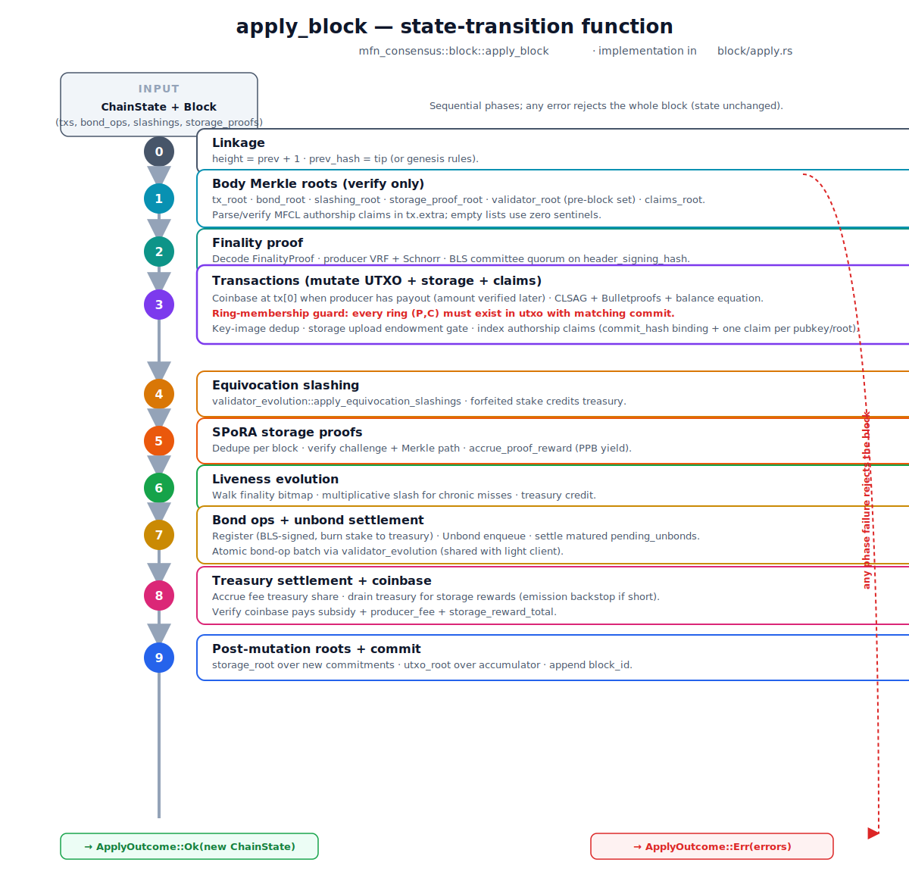

# Architecture

> **Audience.** Engineers, cryptographers, and protocol designers. Whitepaper-grade depth, but kept readable.
> If you'd rather read the intuition first, start with [`OVERVIEW.md`](./OVERVIEW.md).

---

## Table of contents

1. [Design pillars](#design-pillars)
2. [Wire codec (MFBN-1)](#wire-codec-mfbn-1)
3. [Domain separation](#domain-separation)
4. [Cryptographic primitives](#cryptographic-primitives)
5. [Data model](#data-model)
6. [Transaction lifecycle](#transaction-lifecycle)
7. [Block lifecycle](#block-lifecycle)
8. [State-transition function (`apply_block`)](#state-transition-function-apply_block)
9. [Storage subsystem (SPoRA + endowment)](#storage-subsystem-spora--endowment)
10. [Consensus subsystem (PoS + slashing)](#consensus-subsystem-pos--slashing)
11. [Economic model](#economic-model)
12. [Security model](#security-model)
13. [Audited dependencies](#audited-dependencies)
14. [Crate layout](#crate-layout)

---

## Design pillars

The protocol is defined by seven non-negotiable invariants. Every design decision in this repository is downstream of one or more of these.

1. **Determinism.** Byte-identical replay across implementations (Rust here, TypeScript reference in `cloonan-group/lib/network`). All math is integer; all serialization is big-endian; all hash inputs are domain-separated; all map/set iterations are explicit-ordered.
2. **Confidentiality by default.** Every regular transaction hides senders (ring signature), receivers (stealth address), and amounts (Pedersen commitment + range proof). There is no "transparent mode" for regular transfers. Coinbase is the only transparent transaction class, and it's structurally distinguishable.
3. **Permanence as a consensus invariant.** Storage upload tx → upfront endowment that the protocol math says is sufficient to pay storage operators forever. The endowment formula is enforced by `apply_block`. There is no off-chain bookkeeping.
4. **Privacy revenue funds permanence.** Default 90% of every priority fee flows into the treasury. The treasury funds per-slot storage yield. There is no separate "compute layer" to monetize. The two halves of the network are economically interlocked.
5. **No `unsafe` code.** Workspace-level `#![forbid(unsafe_code)]`. If a primitive can't be implemented safely, we don't ship it. (Audited transitive deps may still contain `unsafe`; we accept that.)
6. **Audited libraries only.** `curve25519-dalek`, `sha2`, `subtle`, `zeroize`, `rand_core`, `bls12_381_plus`. See [§ Audited dependencies](#audited-dependencies).
7. **Hard-fork-by-design.** Every domain tag, every wire format, every consensus parameter is frozen at genesis. Changes are explicit forks, not silent migrations.

---

## Wire codec (MFBN-1)

All on-chain bytes — transaction ids, block hashes, signature inputs — are encoded with a custom canonical format named **MFBN-1**. Mirrored implementation: `mfn_crypto::codec` in Rust, `lib/network/codec.ts` in TS.

### Atoms

| Type | Encoding |
|---|---|
| `u8` | 1 byte |
| `u16` | 2 bytes, big-endian |
| `u32` | 4 bytes, big-endian |
| `u64` | 8 bytes, big-endian |
| `Scalar` | 32 bytes, **little-endian** (matches `curve25519-dalek::Scalar::to_bytes`) |
| `EdwardsPoint` | 32 bytes, compressed Edwards Y-coordinate + sign bit |
| `varint` | Unsigned LEB128, capped at 10 bytes |
| `[u8; 32]` | 32 bytes raw (hash digests) |
| `blob` | `varint(len) ‖ raw_bytes` |
| `vec<T>` | `varint(len) ‖ T_0 ‖ T_1 ‖ …` |

### Why custom

Off-the-shelf options (CBOR, protobuf, RLP, SCALE) all have *one* or more of these failure modes for a consensus chain:

- Length-prefix ambiguity (multiple valid encodings of the same value).
- Implicit floats or signed integers.
- Map ordering not specified (CBOR canonical-CBOR exists but is rarely enforced).
- Endianness mismatch with the cryptographic libraries we use.

MFBN-1 is the smallest possible deterministic codec that exactly matches our primitive byte layouts. Every encoder is paired with an exact-match decoder.

### Round-trippable block bytes (M2.0.10)

The canonical full-block codec now lives in `mfn-consensus::block`:

```text
encode_block(block) =
  block_header_bytes(header)
  varint(txs.len)             || blob(encode_transaction(tx))*
  varint(bond_ops.len)        || blob(encode_bond_op(op))*
  varint(slashings.len)       || blob(encode_evidence(evidence))*
  varint(storage_proofs.len)  || blob(encode_storage_proof(proof))*
```

This is deliberately a composition of existing canonical codecs: M2.0.9's `block_header_bytes` / `decode_block_header`, M2.0.10's `encode_transaction` / `decode_transaction`, the M1 bond-op codec, the slashing-evidence codec, and the SPoRA storage-proof codec. Decoding is structural only; validity is still established by `verify_header`, `verify_block_body`, and `apply_block`.

Strictness rules:

- Any trailing bytes after a header, transaction, storage commitment, slashing evidence, storage proof, or full block reject.
- Nested CLSAG / Bulletproof blobs must decode and re-encode to the same bytes.
- Attacker-controlled body-section counts are not used as allocation capacities; malformed huge counts fail against the finite buffer instead of aborting the process.

See [`M2_BLOCK_CODEC.md`](./M2_BLOCK_CODEC.md) for the full wire layout and test matrix.

### Hashing convention

Every chain-significant hash is computed as:

```text
dhash(DOMAIN, parts) := SHA-256( "MFBN-1/<purpose>" || part_0 || part_1 || … )
```

Where `parts` is a slice of byte-slices and `DOMAIN` is one of the constants in [`mfn_crypto::domain`](../mfn-crypto/src/domain.rs).

---

## Domain separation

Every hash carries an unambiguous **purpose tag** prefix. The full set (current as of [`mfn-crypto::domain`](../mfn-crypto/src/domain.rs)):

| Tag | Purpose |
|---|---|
| `MFBN-1/tx-id` | Canonical transaction id |
| `MFBN-1/tx-preimage` | Transaction preimage (signed by CLSAG) |
| `MFBN-1/block-id` | Block id |
| `MFBN-1/block-header` | Header bytes for header-signing |
| `MFBN-1/storage-commit` | StorageCommitment canonical hash |
| `MFBN-1/chunk-hash` | Per-chunk SHA-256 (data side) |
| `MFBN-1/merkle-leaf` | Merkle tree leaf hash |
| `MFBN-1/merkle-node` | Merkle tree internal node hash |
| `MFBN-1/vrf-input` | VRF input transcript |
| `MFBN-1/vrf-challenge` | VRF Fiat-Shamir challenge |
| `MFBN-1/vrf-output` | VRF output expansion |
| `MFBN-1/bls-sig` | BLS aggregate transcript |
| `MFBN-1/bp-inner-product` | Bulletproof inner-product transcript |
| `MFBN-1/bp-range` | Bulletproof range transcript |
| `MFBN-1/consensus-slot` | Consensus slot seed |
| `MFBN-1/consensus-vote` | Consensus vote transcript |
| `MFBN-1/clsag-agg-{P,C}` | CLSAG aggregated challenges |
| `MFBN-1/clsag-ring` | CLSAG ring challenge |
| `MFBN-1/range-{bit,final}` | Range proof bit / final challenge |
| `MFBN-1/amount-mask-{v,b}` | Amount-mask derivation (value, blinding) |
| `MFBN-1/coinbase-{tx-key,blind}` | Coinbase derivation |
| `MFBN-1/utxo-{leaf,node,empty}` | UTXO accumulator |
| `MFBN-1/oom-challenge` | One-out-of-Many challenge |
| `MFBN-1/bond-op-leaf` | Bond-op Merkle leaf (M1) |
| `MFBN-1/register-op-sig` | `BondOp::Register` BLS-signed authorization payload (M1.5) |
| `MFBN-1/unbond-op-sig` | `BondOp::Unbond` BLS-signed authorization payload (M1) |
| `MFBN-1/validator-leaf` | Validator-set Merkle leaf (M2.0) |
| `MFBN-1/slashing-leaf` | Slashing-evidence Merkle leaf (M2.0.1) |
| `MFBN-1/storage-proof-leaf` | Storage-proof Merkle leaf (M2.0.2) |
| `MFBN-1/light-checkpoint` | LightChain checkpoint integrity tag (M2.0.9) |
| `MFBN-1/kzg-{setup,transcript}` | KZG (reserved, not yet active) |

Reusing a tag for a new purpose is a hard fork by construction.

---

## Cryptographic primitives

| Primitive | Crate | Source module | Tests |
|---|---|---|---|
| Scalar ops (`mod L`) | `mfn-crypto` | `scalar.rs` | ✓ |
| Point ops (Ed25519) | `mfn-crypto` | `point.rs` | ✓ |
| Generators `G`, `H = hash_to_point(G)` | `mfn-crypto` | `point.rs` | ✓ |
| Hash-to-scalar / hash-to-point | `mfn-crypto` | `hash.rs` | ✓ |
| `dhash` (domain-separated SHA-256) | `mfn-crypto` | `hash.rs` | ✓ |
| Schnorr signature | `mfn-crypto` | `schnorr.rs` | ✓ |
| Pedersen commitment (value, blinding) | `mfn-crypto` | `pedersen.rs` | ✓ |
| Stealth address (dual-key CryptoNote) | `mfn-crypto` | `stealth.rs` | ✓ |
| Encrypted-amount blob (RingCT-style) | `mfn-crypto` | `encrypted_amount.rs` | ✓ |
| LSAG ring signature | `mfn-crypto` | `lsag.rs` | ✓ |
| CLSAG ring signature | `mfn-crypto` | `clsag.rs` | ✓ |
| VRF (ECVRF over ed25519) | `mfn-crypto` | `vrf.rs` | ✓ |
| O(N) range proof (Maxwell-style) | `mfn-crypto` | `range.rs` | ✓ |
| Bulletproof range proof | `mfn-crypto` | `bulletproofs.rs` | ✓ |
| One-out-of-Many ZK (Groth–Kohlweiss) | `mfn-crypto` | `oom.rs` | ✓ |
| Gamma-distributed decoy sampling | `mfn-crypto` | `decoy.rs` | ✓ |
| UTXO sparse-Merkle accumulator (depth 32) | `mfn-crypto` | `utxo_tree.rs` | ✓ |
| Binary Merkle tree (over pre-hashed leaves) | `mfn-crypto` | `merkle.rs` | ✓ |
| BLS12-381 signatures + aggregation | `mfn-bls` | `sig.rs` | ✓ |
| SPoRA storage proof | `mfn-storage` | `spora.rs` | ✓ |
| Endowment math (incl. PPB accumulator) | `mfn-storage` | `endowment.rs` | ✓ |

For the math of each primitive, see [`PRIVACY.md`](./PRIVACY.md) and [`STORAGE.md`](./STORAGE.md).

---

## Data model

### Output (UTXO)

Every output on the chain has the form:

```rust
struct UtxoEntry {
    commit: EdwardsPoint,  // Pedersen commitment to the hidden amount
    height: u32,           // block height anchored at (drives gamma age weighting)
}
```

Indexed in the chain state by the compressed bytes of the output's **one-time address** (a 32-byte Edwards point). The one-time address itself is computed by the sender using stealth-address derivation against the recipient's published view/spend keys.

### Storage commitment

```rust
struct StorageCommitment {
    data_root:    [u8; 32],     // Merkle root of 256 KiB chunks
    size_bytes:   u64,
    chunk_size:   u32,
    num_chunks:   u32,
    replication:  u8,           // enforced in [min_replication, max_replication]
    endowment:    EdwardsPoint, // Pedersen commitment to the endowment amount
}
```

The endowment is **amount-private** by default — the commitment hides how much MFN was locked up. But because `apply_block` knows the required endowment for a commitment (from `size_bytes` and `replication`), it can compute the required Pedersen commitment ahead of time and verify the upload tx's fee earmark matches.

### Transaction (regular, RingCT-style)

```rust
struct TransactionWire {
    version:        u32,
    inputs:         Vec<TxInputWire>,    // each carries a CLSAG ring + key image
    outputs:        Vec<TxOutputWire>,   // stealth one-time addrs + commits + range proofs
    fee:            u64,
    storage_commit: Option<StorageCommitment>,  // optional permanent-storage payload
    // ... encrypted amount blobs, ephemeral pubkey, etc.
}
```

### Coinbase

A coinbase is structurally a transaction with **zero inputs** and **one output** plus a designated payout commitment. It's deterministic — derived from the producer's `PayoutAddress` plus the block context — so any node replays it byte-identically.

### Block

```rust
struct Block {
    header:         BlockHeader,
    txs:            Vec<TransactionWire>,  // txs[0] may be coinbase
    slashings:      Vec<SlashEvidence>,    // equivocation evidence anchored in this block
    storage_proofs: Vec<StorageProof>,     // SPoRA proofs answering this block's challenges
    bond_ops:       Vec<BondOp>,           // M1 — Register / Unbond
}
```

### Block header

```rust
struct BlockHeader {
    version:        u32,        // current: HEADER_VERSION = 1
    prev_hash:      [u8; 32],
    height:         u32,
    slot:           u32,
    timestamp:      u64,
    tx_root:        [u8; 32],   // merkle over tx_ids
    storage_root:   [u8; 32],   // merkle over storage commitment hashes
    bond_root:      [u8; 32],   // M1 — merkle over bond_ops (zero sentinel if empty)
    slashing_root:      [u8; 32],   // M2.0.1 — merkle over slashings (zero sentinel if empty)
    validator_root:     [u8; 32],   // M2.0 — merkle over *pre-block* validator set
    storage_proof_root: [u8; 32],   // M2.0.2 — merkle over block.storage_proofs (zero sentinel if empty)
    producer_proof:     Vec<u8>,    // MFBN-encoded FinalityProof
    utxo_root:          [u8; 32],   // accumulator root *after* this block applies
}
```

#### `storage_proof_root` (M2.0.2)

A 32-byte Merkle root over the block's storage proofs in **producer-emit order**. The leaf for each proof is:

```text
storage_proof_leaf_hash(p) = dhash(STORAGE_PROOF_LEAF, encode_storage_proof(p))
```

where `encode_storage_proof` is the canonical SPoRA proof wire form (the same bytes `verify_storage_proof` consumes — there is no separate "for-Merkle-only" encoding). Empty list → all-zero sentinel.

Three design points worth pinning:

1. **Producer-emit order, not sorted.** `apply_block` rejects duplicate proofs per commitment in a single block, and the chain pays out yield to the first proof that lands. Re-sorting would force the applier to also re-sort just to verify the header, and would lose the natural alignment between "the order the producer wrote them" and "the order the payouts happened".
2. **No second encoding.** The leaf hash rides on top of `encode_storage_proof`, so there's only one canonical form of a `StorageProof` to keep in sync between the verifier and the commitment.
3. **`block.storage_proofs`, post-validation.** `apply_block`'s storage-proof phase verifies each proof against the live commitment; the Merkle root just commits to what was *included* in the body. Tampering with the root after sealing breaks the BLS aggregate the producer signed.

#### `validator_root` (M2.0)

A 32-byte Merkle root over the chain's **pre-block** validator set in canonical (chain-stored) index order. The leaf for each validator is:

```text
dhash(VALIDATOR_LEAF,
      index(u32, BE) ‖ stake(u64, BE)
   ‖  vrf_pk(32) ‖ bls_pk(48)
   ‖  payout_flag(u8) ‖ [view_pub(32) ‖ spend_pub(32)]?)
```

Two design points worth pinning:

1. **Pre-block, not post-block.** Committing to the validator set the block was *produced against* lets a light client verify the header (producer eligibility, BLS finality bitmap, quorum) from the header alone, without holding the live validator list. Any rotation / slashing applied *by* this block moves the **next** header's `validator_root`.
2. **No `ValidatorStats`.** Liveness counters churn every block; reincluding them would re-hash every leaf needlessly. The minimal data a light client needs to verify a finality bitmap is `(index, stake, bls_pk)`; the other fields round out the canonical record for completeness.

Empty validator set → all-zero sentinel (matches the other consensus roots).

### Chain state

```rust
struct ChainState {
    height:                  Option<u32>,
    utxo:                    HashMap<[u8; 32], UtxoEntry>,
    spent_key_images:        HashSet<[u8; 32]>,
    storage:                 HashMap<[u8; 32], StorageEntry>,
    block_ids:               Vec<[u8; 32]>,
    validators:              Vec<Validator>,
    validator_stats:         Vec<ValidatorStats>,  // aligned with validators by index
    params:                  ConsensusParams,
    emission_params:         EmissionParams,
    endowment_params:        EndowmentParams,
    bonding_params:          BondingParams,                  // M1
    bond_epoch_id:           u64,                             // M1
    bond_epoch_entry_count:  u32,                             // M1 — epoch entry-churn counter
    bond_epoch_exit_count:   u32,                             // M1 — epoch exit-churn counter
    next_validator_index:    u32,                             // M1 — monotonic; never reused
    pending_unbonds:         BTreeMap<u32, PendingUnbond>,   // M1 — keyed by validator index
    treasury:                u128,
    utxo_tree:               UtxoTreeState,  // depth-32 sparse Merkle accumulator
}
```

---

## Transaction lifecycle

End-to-end: a transaction's journey from the user's wallet to a finalized block.

```mermaid
sequenceDiagram
    autonumber
    participant W as Wallet
    participant M as Mempool<br/>(future: mfn-node)
    participant P as Block Producer<br/>(slot-eligible validator)
    participant C as Committee<br/>(N validators)
    participant S as State Machine<br/>(apply_block)

    W->>W: Pick inputs · sample 15 gamma decoys per input<br/>Compute stealth one-time addrs · Pedersen-commit each output<br/>Bulletproof range proof per output · CLSAG-sign each input<br/>(optionally attach a StorageCommitment)
    W->>M: Broadcast TransactionWire
    M->>M: Admit (fee threshold, no key-image collision)
    M->>P: Forward tx pool

    Note over P: Slot S elapses
    P->>P: Compute VRF over slot_seed(prev_id&#44; S)<br/>Eligible iff output &lt; eligibility_threshold(stake&#44; total_stake)
    P->>P: Gather txs + slashings + storage_proofs<br/>Build BlockHeader · broadcast for voting

    P->>C: header_signing_hash(header)
    C-->>P: CommitteeVote { idx, BLS-sig(hash) }
    P->>P: Aggregate votes · pack FinalityProof<br/>(quorum ≥ quorum_stake_bps stake share)
    P->>S: Block { header, txs, slashings, storage_proofs }

    S->>S: apply_block (the 7-phase pipeline above)
    alt all phases pass
        S-->>S: Commit new ChainState · append block_id
    else any phase fails
        S-->>P: Vec&lt;BlockError&gt; · block dropped
    end
```

---

## Block lifecycle

The block's lifecycle once it reaches a node:

1. **Decode.** Parse header + body via MFBN-1.
2. **Header sanity.** `version == HEADER_VERSION`, `height == prev_height + 1`, `prev_hash == prev_block_id`, `timestamp` strictly increases.
3. **Finality.** Decode `producer_proof` as `FinalityProof`; verify against the chain's known validator set, checking quorum and BLS aggregate.
4. **Apply.** Pass to `apply_block(state, block) -> Result<NewState, BlockError>`.

`apply_block` is the **only** function that mutates chain state. It's a pure function in the algebraic sense: same `(state, block)` always produces the same `NewState` (or the same error list).

---

## State-transition function (`apply_block`)

`mfn_consensus::apply_block` is the heart of the protocol. What follows is a flattened summary of every check, in order. The full implementation is in [`mfn-consensus/src/block.rs`](../mfn-consensus/src/block.rs).

<p align="center">
  
</p>


### Phase 0 — Header & finality

- Reject if `header.height != prev_height + 1` (or `0` if genesis).
- Reject if `header.prev_hash != prev_tip_id`.
- Reject if `header.timestamp <= prev_timestamp`.
- Reject if `header.version != HEADER_VERSION`.
- Verify `FinalityProof` against `state.validators`:
  - Decode `producer_proof` as a `FinalityProof`.
  - Producer ed25519 + VRF (header-signing-hash signed; VRF output below threshold).
  - Committee BLS aggregate: signed message must equal `header_signing_hash(header)`, signers' stake must reach quorum, no validator double-counted.
- Capture the finality bitmap for liveness tracking later.

### Phase 1 — Roots

- Reconstruct `tx_root` from `txs` and reject if `header.tx_root` differs.
- Reconstruct `bond_root` from `block.bond_ops` (zero sentinel for empty) and reject if it differs from `header.bond_root`.
- **Reconstruct `slashing_root` from `block.slashings` (M2.0.1).** Each leaf is the canonicalized form of one equivocation evidence piece (pair-order normalized so a swapped `(hash_a, hash_b)` hashes to the same leaf). Empty list → all-zero sentinel.
- **Reconstruct `validator_root` from the *pre-block* validator set (M2.0)** and reject if it differs from `header.validator_root`. Committing to the pre-block set means a light client can verify Phase 0's finality proof from the header alone, *before* it has any of this block's state. Rotation / slashing / unbond settlement applied later in `apply_block` move the **next** header's `validator_root`, not this one's.
- **Reconstruct `storage_proof_root` from `block.storage_proofs` (M2.0.2).** Each leaf is `dhash(STORAGE_PROOF_LEAF, encode_storage_proof(p))` — the same canonical SPoRA wire bytes the per-proof verifier consumes. Order is producer-emit (the chain pays out yield to the first proof that lands; re-sorting would lose that alignment). Empty list → all-zero sentinel.
- Build the list of new storage commitments anchored in this block (from `txs[*].storage_commit` and `Block.slashings` etc.). Reconstruct `storage_root`.

### Phase 2 — Slashing (equivocation)

For each `SlashEvidence` in `block.slashings`:
- Verify it's a valid pair of conflicting BLS-signed headers at the same slot by the same validator.
- Set that validator's stake to zero in `next_state.validators` (full equivocation slashing).
- Record their `liveness_slashes`-style stat unaffected; equivocation is a separate, harsher class.

### Phase 3 — Transactions

For each tx position `ti`:

#### Coinbase (only at position 0, only when producer has a payout address)

- Structural check (`is_coinbase_shaped`): zero inputs, exactly one output, deterministic key derivation tags present.
- `verify_coinbase(coinbase, block_context, expected_amount, expected_blinding)`:
  - The amount the chain commits to is `emission(height) + producer_fee_share`, where `producer_fee_share = (1 - fee_to_treasury_bps/10000) × total_fee_of_block`.
  - The blinding factor must derive from the producer's payout address via `dhash(COINBASE_BLIND, …)`.
- Anchor the coinbase output into `next.utxo` and `next.utxo_tree`.

#### Regular transaction

- `verify_transaction` performs the cryptographic checks: every CLSAG verifies, every range proof verifies, the balance equation cancels.
- **Ring-membership check** (consensus-critical, post-counterfeit-input-fix): for every CLSAG input, every `(P, C)` pair in the ring must exist as a real `UtxoEntry` in `next.utxo`, and the `C` must match exactly. Without this check, an attacker could fabricate ring members with arbitrary hidden commitments and mint money. See [`PRIVACY.md § Counterfeit-input attack`](./PRIVACY.md#counterfeit-input-attack-closed).
- **Key image uniqueness**: every input's key image must NOT be in `next.spent_key_images`. Insert it if accepted.
- **Storage upload endowment check**: if `tx.storage_commit.is_some()`:
  - Compute `required = required_endowment(size_bytes, replication, endowment_params)`.
  - Verify `tx.fee` to-treasury share (`fee × fee_to_treasury_bps / 10000`) is ≥ `required`.
  - Verify `replication ∈ [min_replication, max_replication]`.
  - Register `StorageEntry { commit, last_proven_height = height, last_proven_slot = slot, pending_yield_ppb = 0 }` in `next.storage`.
- **State updates**:
  - Insert each new output's `(one_time_addr, UtxoEntry { commit, height })` into `next.utxo`.
  - Append each output to the `next.utxo_tree` accumulator.
  - Insert each input's key image into `next.spent_key_images`.
  - Add `fee × fee_to_treasury_bps / 10000` to `next.treasury`.

### Phase 4 — Storage proofs (per-block SPoRA audit)

For each `StorageProof` in `block.storage_proofs`:

- Reject duplicates within the same block (one proof per commitment per block).
- Look up the target `StorageEntry` by `proof.commit_hash`; reject if unknown.
- `verify_storage_proof(commit, prev_block_id, block.slot, proof)` checks:
  - The `chunk_index` matches the deterministic challenge derivation `chunk_index_for_challenge(prev, slot, commit_hash, num_chunks)`.
  - The Merkle proof connects `chunk_hash(chunk)` to `commit.data_root`.
- On success, call `accrue_proof_reward(entry, slot, endowment_params, treasury)`:
  - Compute elapsed slots since `entry.last_proven_slot`, capped at `proof_reward_window_slots`.
  - Compute `per_slot_payout` in PPB.
  - Add `elapsed × per_slot_payout` to `entry.pending_yield_ppb`.
  - Flush any whole-base-unit amount into the proof reward (paid to whoever submitted the proof).
- Update `entry.last_proven_height = height`, `entry.last_proven_slot = slot`.

### Phase 5 — Two-sided treasury settlement

After all per-tx fee shares are accumulated and all SPoRA rewards are flushed:

- Total storage reward = sum of base units paid out across all accepted proofs.
- Drain `next.treasury -= storage_reward_total` (saturating at 0).
- Emission **backstop**: if `treasury` is insufficient to cover the storage reward, mint the shortfall as fresh tokens via `emission_params.storage_proof_reward`. This is the only sustained sink for new tokens beyond the regular subsidy.

### Phase 6 — Liveness tracking + auto-slashing

Walk the captured finality bitmap. For each validator `i` (skipping zero-stake validators):

- If bit `i` is set: `consecutive_missed = 0`, `total_signed += 1`.
- If bit `i` is unset: `consecutive_missed += 1`, `total_missed += 1`.
- If `consecutive_missed >= liveness_max_consecutive_missed`:
  - `new_stake = stake × (10_000 − liveness_slash_bps) / 10_000` (multiplicative reduction).
  - `liveness_slashes += 1`.
  - Reset `consecutive_missed = 0`.
  - **Credit the forfeited stake delta to `next.treasury`** (saturating `u128`).

### Phase 7 — Bond operations (M1)

[`simulate_bond_ops`](../mfn-consensus/src/block.rs) runs **atomically** over `block.bond_ops`, validated against the pre-bond view of the chain. Any rejection (bad signature, churn-cap exhaustion, unknown validator, vrf-key collision, duplicate unbond, …) rolls back the entire bond-op set so the binding `bond_root` commitment remains intact.

- `BondOp::Register { stake, vrf_pk, bls_pk, payout, sig }`:
  - Stake validated by `bonding::validate_stake` (≥ `min_validator_stake`).
  - **Operator authorization (M1.5).** `sig` BLS-verified by `verify_register_sig` against `bls_pk` over `dhash(REGISTER_OP_SIG, stake ‖ vrf_pk ‖ bls_pk ‖ payout_flag ‖ [payout?])`. The signed payload includes `bls_pk` itself so a leaked op cannot be replayed with swapped keys.
  - `vrf_pk` must be unique across the active set.
  - Per-epoch entry-churn cap enforced via `try_register_entry_churn`.
  - Append a new `Validator` (index `= next.next_validator_index`, `next.next_validator_index += 1`) and a lockstep fresh `ValidatorStats` row.
  - **Burn `stake` into `next.treasury`** (the closed-loop permanence sink).
- `BondOp::Unbond { validator_index, sig }`:
  - BLS-verify `sig` against the validator's `bls_pk` over `dhash(UNBOND_OP_SIG, validator_index.to_be_bytes())`.
  - Reject unknown / zombie / duplicate validators.
  - Per-epoch exit-churn cap enforced via `try_register_exit_churn`.
  - Insert `PendingUnbond { validator_index, unlock_height = height + unbond_delay_blocks, stake_at_request, request_height }` into `next.pending_unbonds`.
  - **The validator stays live and slashable** for the duration of the delay.

### Phase 8 — Unbond settlement (M1)

Walk `next.pending_unbonds` in ascending `validator_index` order. For each entry with `unlock_height ≤ height`:

- Zero the validator's `stake` (becomes a non-signing zombie at the same index).
- Remove the entry from `pending_unbonds`.
- The originally bonded MFN **stays in `next.treasury`** — M1 leaves it as a permanent contribution to permanence. Explicit operator payouts on settlement are deferred to a future milestone (see [`M1_VALIDATOR_ROTATION.md § Future work`](./M1_VALIDATOR_ROTATION.md#future-work)).
- Settlement runs *after* slashing, so a validator who unbonds and then equivocates inside the delay is still fully forfeited (and the slash credits the treasury).

### Phase 9 — Root checks + commit

- Recompute `utxo_root` from `next.utxo_tree` and reject if it differs from `header.utxo_root`.
- Append `block_id(header)` to `next.block_ids`.
- Return `Ok(next)`.

(Per-input Merkle roots — `tx_root`, `bond_root`, `slashing_root`, `validator_root`, `storage_proof_root`, `storage_root` — are all verified in **Phase 1**, before any state mutation. Only `utxo_root`, which depends on the post-block accumulator, is checked here. **The header now binds every body element** — `txs`, `bond_ops`, `slashings`, the pre-block validator set, and `storage_proofs` — closing the "header binds the body" invariant.)

---

## Storage subsystem (SPoRA + endowment)

### Why SPoRA

Naively, you'd ask storage operators to publish "I still have file F" attestations. But attestations are just signatures over a string; they're cheap to forge if you've thrown the file away. **Succinct Proofs of Random Access** force the prover to actually pull a specific (challenger-chosen) chunk from disk and prove via Merkle authentication path that the chunk is part of the committed file.

### Chunking

- `DEFAULT_CHUNK_SIZE = 256 * 1024` bytes (256 KiB).
- A file of `size_bytes` is split into `num_chunks = ceil(size_bytes / chunk_size)`.
- The last chunk is padded on the prover side; the verifier knows the trailing length from `size_bytes`.

### Chunk hashes + Merkle tree

```
chunk_hash_i = dhash(CHUNK_HASH, chunk_bytes_i)
data_root   = merkle_root_or_zero({chunk_hash_0, …, chunk_hash_{n-1}})
              (using MERKLE_LEAF for the leaf wrap and MERKLE_NODE for internal nodes)
```

### Challenge derivation

Deterministic from the *previous* block id + this block's slot + the commitment hash:

```
chunk_index_for_challenge(prev_id, slot, commit_hash, num_chunks)
  = challenge_index_from_seed(
      dhash(STORAGE_COMMIT, [prev_id, slot.to_be_bytes(), commit_hash]),
      num_chunks
    )
```

`challenge_index_from_seed` interprets the seed as a big-endian `u128` and reduces modulo `num_chunks` using rejection sampling to avoid bias.

Predictability properties:
- Every node — including the operator — can compute the answer the moment a new block lands.
- No node can compute the answer *for a future block* without knowing `prev_id`, which itself depends on the future block being finalized.
- The operator races to publish a proof; first valid one earns the yield.

### Wire-format StorageProof

```rust
struct StorageProof {
    commit_hash: [u8; 32],
    chunk:       Vec<u8>,        // the 256 KiB (or partial-final) chunk bytes
    proof:       Vec<[u8; 32]>,  // Merkle authentication path
}
```

Encoded by `encode_storage_proof` / decoded by `decode_storage_proof`. See [`STORAGE.md`](./STORAGE.md) for the full byte layout.

### Endowment formula

The protocol-required upfront escrow for a new commitment, derived from a geometric-series finance argument (full derivation in [`ECONOMICS.md § Endowment derivation`](./ECONOMICS.md#1-the-permanence-equation-derived)):

```text
E₀ = C₀ · (1 + i) / (r − i)
```

with:
- `C₀ = cost_per_byte_year_ppb × size_bytes × replication / PPB` (first-year storage cost, in base units)
- `i = inflation_ppb / PPB` (annual storage-cost inflation)
- `r = real_yield_ppb / PPB` (annual real yield)
- **Non-degeneracy:** `r > i` is the precondition enforced by `validate_endowment_params`.

In Rust (`mfn_storage::endowment::required_endowment`), all arithmetic is `u128` integer with ceiling division to avoid float drift and accidental under-funding.

### PPB-precision yield accumulator

Per-slot yield can be a tiny fraction of a base unit (sub-satoshi). Directly converting it to an integer per slot would always round to zero. Instead, each `StorageEntry` carries `pending_yield_ppb: u128` — an accumulator in parts-per-billion. Each accepted proof adds `elapsed_slots × per_slot_payout_ppb` to the accumulator and flushes whole base units. The chain pays out exactly the integer that has accumulated; the fractional remainder carries over.

This is the same trick the Linux kernel uses for sub-nanosecond timing carries. Fully deterministic.

---

## Consensus subsystem (PoS + slashing)

### Slot model

Time is divided into **slots** of fixed wall-clock length (default 12 seconds). Every slot has 0 or more eligible producers.

### Leader election (stake-weighted VRF)

For slot `S` with previous block id `prev_id`:

```
slot_seed = dhash(CONSENSUS_SLOT, [prev_id, S.to_be_bytes()])
```

Every validator computes their VRF over the slot seed using their secret VRF key. The VRF output, interpreted as a `u64`, is compared against an eligibility threshold derived from the validator's stake fraction:

```
threshold(stake, total_stake, expected_proposers_per_slot)
  ≈ stake/total_stake × expected_proposers_per_slot × u64::MAX
```

Eligible producers race to publish. If multiple eligible producers produce, `pick_winner` resolves by lowest VRF output (`output_as_u64`). This is Algorand-style — *cryptographic sortition*.

### Committee finality (BLS12-381)

Every validator BLS-signs `header_signing_hash(header)`. The producer aggregates signatures into a `CommitteeAggregate`, packs it into a `FinalityProof`, and that becomes the header's `producer_proof`. Verification:

- Aggregate public keys of all signers (per the bitmap) → `agg_pk`.
- Verify `BLS_VERIFY(agg_pk, signing_hash, agg_sig)`.
- Sum stake of signers; reject if `< quorum_stake_bps × total_stake / 10_000`.

Default quorum: `6667` bps (= 2/3 + 1bp). This is the **finality bar**; once met, the block is irreversible.

### Equivocation slashing

If a validator BLS-signs two distinct headers at the same height, an observer can publish both as `SlashEvidence`. The chain canonicalizes the pair, verifies both signatures, and **zeros the offending validator's stake** in the next state. Permanent removal.

### Liveness slashing

Tracked per `ValidatorStats` in chain state. After each block's finality verification:
- If a validator's bit is set in the bitmap, their `consecutive_missed` resets.
- If unset, `consecutive_missed += 1`.
- If `consecutive_missed >= liveness_max_consecutive_missed` (default 32 ≈ 6.4 min), apply a **multiplicative slash** of `liveness_slash_bps` (default 100 = 1%). 100 successive slashes drop stake by ≈ `e^{-1}` ≈ 63%.

See [`CONSENSUS.md`](./CONSENSUS.md) for the full proof of why multiplicative slashing is correct vs. additive.

---

## Economic model

### Emission curve (hybrid)

Bitcoin halvings → asymptote to a Monero-like tail. Default `EmissionParams`:
- `initial_reward = 50 MFN` per block.
- `halving_period = 8_000_000` blocks (≈ 3 years at 12s slots).
- `halving_count = 8`.
- `tail_emission = (50 MFN) >> 8` ≈ 0.195 MFN per block, forever.

The tail-vs.-last-halving constraint (`tail_emission ≤ initial_reward >> (halving_count − 1)`) is validated by `validate_emission_params` to prevent an upward discontinuity at the tail boundary.

### Fee split

```
producer_share  = fee × (10_000 − fee_to_treasury_bps) / 10_000
treasury_share  = fee × fee_to_treasury_bps           / 10_000
```

Default `fee_to_treasury_bps = 9000` (90% treasury, 10% producer tip).

The treasury share funds storage rewards. The producer share is added to the coinbase amount alongside emission.

### Storage proof reward (emission backstop)

If the treasury is insufficient to cover accepted proof rewards in a block, the chain mints the shortfall using `storage_proof_reward` (default `MFN_BASE / 10` = 0.1 MFN). This is the *only* sustained sink for new tokens beyond the subsidy curve.

For full economic analysis, parameter calibration, and sensitivity studies, see [`ECONOMICS.md`](./ECONOMICS.md).

---

## Security model

### Adversary capabilities

- **Network observer.** Can see every byte on the chain.
- **Validator-controlling adversary.** Can produce blocks but only up to their stake share.
- **Storage operator.** Can claim to hold any file but only proves what they actually hold.
- **Wallet adversary.** Can offer to receive any tx; can submit txs from any held keys.

### Guarantees

| Property | Mechanism | Status |
|---|---|---|
| Hidden senders | CLSAG ring signatures (default ring size 16) | ✓ live |
| Hidden receivers | Stealth one-time addresses | ✓ live |
| Hidden amounts | Pedersen commitments + Bulletproof range proofs | ✓ live |
| No double-spend | Key-image uniqueness across blocks | ✓ live |
| No counterfeit inputs | Every CLSAG ring member must be a real on-chain UTXO | ✓ live |
| No counterfeit value | Pedersen balance check (in − out − fee = 0) | ✓ live |
| No negative-amount minting | Bulletproof range proof per output | ✓ live |
| No double-publish (equivocation) | BLS-signed evidence anchors → stake zeroed | ✓ live |
| Liveness incentive | Multiplicative stake slash for chronic missed votes | ✓ live |
| Storage permanence | Endowment formula enforced at upload; SPoRA audited every block | ✓ live |
| Forward-secret receivers | Stealth derivation uses per-tx ephemeral randomness | ✓ live |
| Long-range attack resistance | Bonded validators with delayed unbond + slash-during-delay (M1) | ✓ live |
| Censorship resistance | Multi-eligible-producer slots (`expected_proposers_per_slot = 1.5`) | ✓ live |

### Known limitations (honest list)

- **Validator rotation shipped in M1; full header-binds-body commitment family shipped in M2.0.x; light-header + light-body verification + validator-set-evolution + header codec + light checkpoint serialization primitives shipped in M2.0.5 / M2.0.7 / M2.0.8 / M2.0.9.** Bond / unbond / delayed settlement / per-epoch churn caps / slash-to-treasury / BLS-authenticated bond ops / per-block `validator_root` (M2.0) / `slashing_root` (M2.0.1) / `storage_proof_root` (M2.0.2) / `verify_header` (M2.0.5) / `verify_block_body` (M2.0.7) / shared `validator_evolution` helpers (M2.0.8) / round-trippable `BlockHeader` codec + `LightChain` checkpoint (M2.0.9) are all live. The block header now binds every body element, pure-function light verifiers exist to prove both halves stateless-ly, a shared evolution module guarantees byte-for-byte parity between the full-node and light-client validator-set transitions, AND a `LightChain` can be snapshotted to a deterministic self-contained byte blob and restored bit-for-bit — closing the "what about cold starts?" gap for wallets, browser clients, and embedded devices. See [`M1_VALIDATOR_ROTATION.md`](./M1_VALIDATOR_ROTATION.md), [`M2_VALIDATOR_ROOT.md`](./M2_VALIDATOR_ROOT.md), [`M2_STORAGE_PROOF_ROOT.md`](./M2_STORAGE_PROOF_ROOT.md), [`M2_LIGHT_HEADER_VERIFY.md`](./M2_LIGHT_HEADER_VERIFY.md), [`M2_LIGHT_BODY_VERIFY.md`](./M2_LIGHT_BODY_VERIFY.md), [`M2_LIGHT_VALIDATOR_EVOLUTION.md`](./M2_LIGHT_VALIDATOR_EVOLUTION.md), and [`M2_LIGHT_CHECKPOINT.md`](./M2_LIGHT_CHECKPOINT.md).
- **Light client follows a chain across arbitrary rotations and survives restarts.** The cryptographic primitives ([`verify_header`](../mfn-consensus/src/header_verify.rs) M2.0.5, [`verify_block_body`](../mfn-consensus/src/header_verify.rs) M2.0.7) plus the shared evolution module ([`validator_evolution`](../mfn-consensus/src/validator_evolution.rs) M2.0.8) plus the chain-following driver ([`mfn-light`](../mfn-light), M2.0.6 + M2.0.7 + M2.0.8) plus the checkpoint codec ([`mfn-light::checkpoint`](../mfn-light/src/checkpoint.rs), M2.0.9) are live. A `LightChain` bootstraps from a `GenesisConfig` and applies either headers via `apply_header(&BlockHeader)` (linkage + verify_header + tip advance — no evolution) or full blocks via `apply_block(&Block)` (linkage + verify_header + verify_block_body + validator-set evolution + tip advance), and can be saved/restored byte-deterministically via `encode_checkpoint` / `decode_checkpoint` (integrity-tagged under the dedicated `MFBN-1/light-checkpoint` domain). State byte-for-byte preserved on any failure, typed errors distinguishing forged headers / body-tampered pairs / invalid bond ops / corrupted checkpoints. The light client now follows the chain indefinitely AND survives restarts. The P2P/daemon layer is the next slice.
- **No KZG-based UTXO accumulator yet.** Currently we have a sparse-Merkle accumulator (`utxo_tree`, depth 32). KZG would enable smaller log-size membership witnesses; ranked as low-priority.
- **Decoy realism = Monero's heuristic.** Gamma-distributed age sampling is what Monero ships and has known statistical weaknesses in some adversarial contexts. Tier 3 of the roadmap moves to OoM-over-the-whole-UTXO-set, which strictly dominates.

For the disclosure process see [`../SECURITY.md`](../SECURITY.md).

---

## Audited dependencies

This project relies entirely on libraries that have been independently security-reviewed and that ship in production financial infrastructure.

| Crate | Version | Why we use it | Used by Signal/Zcash/Monero/etc.? |
|---|---|---|---|
| `curve25519-dalek` | `4.1.x` | Ed25519 prime-order group, constant-time scalar/point arithmetic. | Signal, ZeroTier, Cloudflare. |
| `sha2` | `0.10.x` | SHA-256 implementation. | Almost every Rust project. |
| `subtle` | `2.5.x` | Constant-time equality. | curve25519-dalek itself. |
| `zeroize` | `1.7.x` | Secure memory wiping for secret keys. | Same. |
| `rand_core` + `getrandom` | `0.6.x` | OS-grade CSPRNG. | Standard Rust crypto stack. |
| `bls12_381_plus` | `0.8.x` | BLS12-381 curve, hash-to-curve, pairings. | Ethereum 2.0 / Filecoin equivalent code paths. |
| `elliptic-curve`, `ff`, `group`, `pairing` | `0.13.x` / `0.13.x` / `0.13.x` / `0.23.x` | Curve trait stack supporting BLS. | RustCrypto org maintained. |
| `thiserror` | `1.0.x` | Boilerplate-free error enum derivation. | Universal. |
| `hex` | `0.4.x` | Hex encoding for debug logs. | Universal. |

No hand-rolled curve code. No FFI. No `unsafe` in any first-party module.

---

## Crate layout

```
mfn-crypto/         ed25519 primitives + ZK    (145 tests)
├── domain.rs       Domain-separation tags
├── codec.rs        MFBN-1 Writer/Reader
├── scalar.rs       Scalar helpers
├── point.rs        Edwards-point helpers + generators G, H
├── hash.rs         dhash, hash_to_scalar, hash_to_point
├── schnorr.rs      Schnorr signatures
├── pedersen.rs     Pedersen commitments
├── stealth.rs      Dual-key stealth addresses (basic + indexed)
├── encrypted_amount.rs   RingCT-style encrypted-amount blobs
├── lsag.rs         LSAG ring signatures
├── clsag.rs        CLSAG ring signatures (production)
├── vrf.rs          ECVRF (RFC 9381) over ed25519
├── range.rs        O(N) Maxwell-style range proofs
├── bulletproofs.rs Log-size range proofs
├── oom.rs          Groth–Kohlweiss one-out-of-many (log-size ring)
├── decoy.rs        Gamma-distributed decoy sampling
├── utxo_tree.rs    Sparse-Merkle UTXO accumulator (depth 32)
└── merkle.rs       Binary Merkle tree over pre-hashed leaves

mfn-bls/            BLS12-381                  (16 tests)
└── sig.rs          BLS signatures + committee aggregation

mfn-storage/        Permanence                 (44 tests)
├── commitment.rs   StorageCommitment canonical hash + M2.0.10 full codec
├── spora.rs        Chunking, Merkle, challenge derivation, build/verify proof,
│                   M2.0.2 storage-proof merkle commitment
└── endowment.rs    E₀ formula, per-slot payout, PPB-precision accumulator

mfn-consensus/      Chain state machine        (181 tests: 167 unit + 14 integration)
├── emission.rs     Hybrid emission curve + fee split
├── bonding.rs      M1 rotation params + pure validation helpers
├── bond_wire.rs    M1 BondOp::{Register, Unbond} wire codec + BLS-signed authorization
├── transaction.rs  RingCT-style tx wire + verify + M2.0.10 full tx codec
├── coinbase.rs     Deterministic coinbase
├── consensus.rs    Slot model, VRF leader election, BLS committee finality,
│                   M2.0 validator-set merkle commitment
├── slashing.rs     Equivocation evidence + verification,
│                   M2.0.1 slashing-evidence merkle commitment
├── storage.rs      Re-exports mfn-storage commitment types
├── header_verify.rs M2.0.5 pure-function light-header verifier
│                   (validator_root + producer-proof + BLS aggregate)
│                   + M2.0.7 verify_block_body — re-derives tx_root /
│                   bond_root / slashing_root / storage_proof_root from
│                   a delivered &Block and matches the header
├── validator_evolution.rs M2.0.8 pure helpers for per-block validator-set
│                   evolution: apply_equivocation_slashings,
│                   apply_liveness_evolution, apply_bond_ops_evolution,
│                   apply_unbond_settlements. Single source of truth used by
│                   both apply_block (full node) and mfn-light's chain
│                   follower. Plus finality_bitmap_from_header for callers
│                   that drive Phase B without re-decoding the proof.
└── block.rs        BlockHeader, Block, ChainState, apply_block (the STF),
                    M2.0.2 storage-proof root binding. Each validator-set
                    mutation is a single call into validator_evolution.
                    M2.0.9 adds decode_block_header (the inverse of
                    block_header_bytes) with typed HeaderDecodeError.
                    M2.0.10 adds encode_block / decode_block.

mfn-node/           Node-side glue             (45 tests: 34 unit + 11 integration)
├── chain.rs        Chain driver: owns ChainState, applies blocks through
│                   apply_block, exposes read-only accessors and typed errors.
├── producer.rs     Block-production helpers: three-stage protocol
│                   (build_proposal → vote_on_proposal → seal_proposal) plus a
│                   produce_solo_block one-call helper for the single-validator
│                   case. The shape future P2P / RPC / mempool integration
│                   consumes.
└── mempool.rs      M2.0.12 + M2.0.13 in-memory transaction pool. Mempool::admit
                    replicates every per-tx gate apply_block runs — both the
                    PRIVACY gates (verify_transaction + ring-membership chain
                    guard with commit match + key-image dedup against
                    state.spent_key_images and within the pool) and the
                    PERMANENCE gates (M2.0.13: replication bounds against
                    state.endowment_params, mfn_storage::required_endowment math,
                    treasury-share-vs-burden where treasury_share = fee *
                    fee_to_treasury_bps / 10_000, with already-anchored data
                    roots and within-tx duplicates silently skipped exactly
                    like apply_block). Implements replace-by-fee
                    (strictly-dominating policy) and size-cap lowest-fee
                    eviction. drain(max) yields highest-fee-first with tx_id
                    tie-break (byte-deterministic block bodies).
                    remove_mined(&Block) evicts entries by block-included key
                    images. Typed AdmitError variants: TxInvalid,
                    RingMemberNotInUtxoSet, RingMemberCommitMismatch,
                    KeyImageAlreadyOnChain, ReplaceTooLow, BelowMinFee,
                    DuplicateTx, PoolFull, NoInputs, StorageReplicationTooLow,
                    StorageReplicationTooHigh, EndowmentMathFailed,
                    UploadUnderfunded. AdmitOutcome distinguishes Fresh /
                    ReplacedByFee / EvictedLowest for future P2P-relay use.

mfn-light/          Light-client follower      (57 passing: 40 unit + 17 integration, 1 ignored)
├── chain.rs        LightChain: tracks tip pointer, trusted validator set,
│                   AND the shadow state needed to evolve that set across
│                   rotations (validator_stats, pending_unbonds,
│                   BondEpochCounters, bonding_params).
│                   apply_header(&BlockHeader) — linkage + verify_header (M2.0.5)
│                                                + tip advance. (No evolution.)
│                   apply_block(&Block) — linkage + verify_header
│                                         + verify_block_body (M2.0.7)
│                                         + validator-set evolution (M2.0.8 via
│                                         shared mfn-consensus helpers)
│                                         + tip advance.
│                   M2.0.9: encode_checkpoint / decode_checkpoint methods
│                           round-trip the full shadow state byte-deterministically.
│                   M2.0.10: integration-proven raw-block-byte path:
│                            decode_block(bytes) → apply_block(&Block).
└── checkpoint.rs   M2.0.9 self-contained checkpoint codec: magic + version
                    + tip + identity + params + validators + stats +
                    pending_unbonds + bond_counters + dhash(LIGHT_CHECKPOINT)
                    integrity tag. Typed LightCheckpointError covers
                    BadMagic / UnsupportedVersion / Truncated /
                    InvalidVrfPublicKey / InvalidBlsPublicKey /
                    StatsLengthMismatch / DuplicateValidatorIndex /
                    PendingUnbondsNotSorted / NextIndexBelowAssigned /
                    IntegrityCheckFailed / TrailingBytes.
                    Pure-Rust deps only; WASM-friendly. Follows the chain
                    indefinitely from a single genesis bootstrap, AND
                    survives restarts via M2.0.9 checkpoint serialization.

mfn-wallet/         Confidential wallet (M2.0.11) (28 passing: 26 unit + 2 e2e integration)
├── keys.rs         WalletKeys (wraps StealthWallet) + wallet_from_seed
│                   (deterministic seed → keys via domain-separated
│                    hash_to_scalar with MFW_SEED_VIEW_V1 / MFW_SEED_SPEND_V1
│                    tags).
├── owned.rs        OwnedOutput (one-time addr, value, blinding, one-time
│                   spend key, PRECOMPUTED key image, height, tx_id, output
│                   idx). verify_pedersen_open — binds the XOR-pad-shaped
│                   `decrypt_output_amount` to the on-chain commitment so a
│                   grinder cannot trick the wallet into claiming phantom
│                   UTXOs. key_image_for_owned uses hash_to_point on the
│                   one-time address.
├── scan.rs         scan_transaction / scan_block — pure, read-only. Walks
│                   every output, runs indexed_stealth_detect, decrypts
│                   the amount blob, verifies Pedersen open. Coinbase
│                   shortcut: re-derives expected coinbase r_pub for our
│                   own spend_pub before scanning per-output. Cross-device
│                   spend detection: every tx input's key image checked
│                   against the wallet's precomputed index.
├── decoy.rs        DecoyPoolBuilder + build_decoy_pool — walks
│                   ChainState.utxo, excludes the wallet's owned outputs,
│                   emits a height-sorted Vec<DecoyCandidate<(P, C)>>
│                   ready for select_gamma_decoys.
├── spend.rs        TransferPlan + build_transfer. Per real input: sample
│                   ring_size-1 decoys with select_gamma_decoys, pick a
│                   uniformly random signer_idx, assemble the ClsagRing,
│                   build the InputSpec. Delegates to
│                   mfn_consensus::sign_transaction for the RingCT
│                   ceremony.
├── wallet.rs       Wallet state container. ingest_block(&Block) is the
│                   single mutation entry point. Wallet::build_transfer
│                   does greedy largest-first coin selection, builds the
│                   decoy pool, adds an implicit change output, calls
│                   spend::build_transfer, and marks the consumed inputs
│                   spent locally so a follow-up build_transfer doesn't
│                   double-spend before the tx mines.
└── error.rs        WalletError — flattens mfn_crypto::CryptoError and
                    mfn_consensus::TxBuildError so callers can `?` either
                    without rewriting matches.
```

For per-crate API summaries see the crate-level READMEs linked from the top of [`../README.md`](../README.md).
