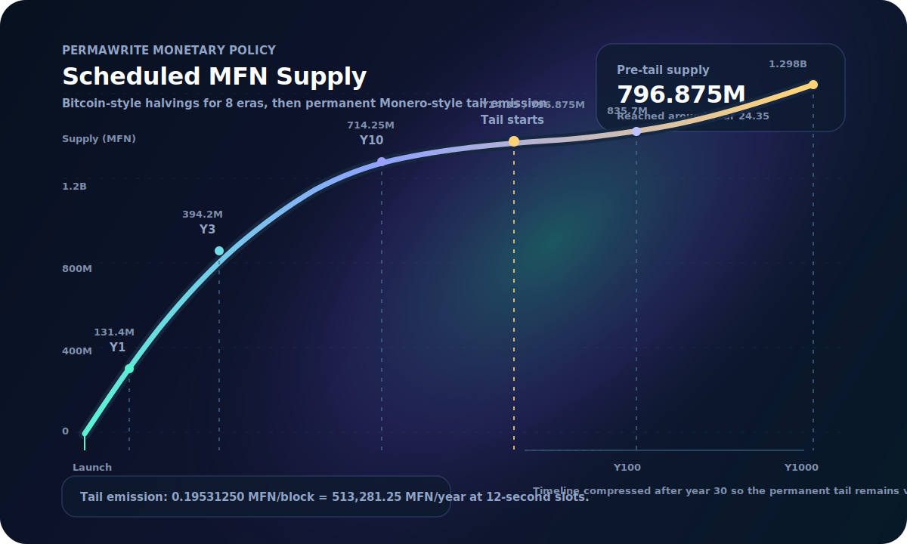

# MFN Supply Curve

Permawrite has a front-loaded subsidy and a tiny permanent tail.

The first 24.35 years behave like a Bitcoin-style halving schedule: high early issuance, then eight binary halvings. After that, issuance becomes a constant `0.19531250 MFN/block` tail so the chain keeps a permanent security budget for permanent storage.

<p align="center">
  
</p>

## Reading The Curve

These numbers are the **scheduled subsidy supply** from `DEFAULT_EMISSION_PARAMS`:

```rust
initial_reward = 50 MFN / block
halving_period = 8,000,000 blocks
halving_count  = 8
tail_emission  = 0.19531250 MFN / block
slot_time      = 12 seconds
```

The table excludes the storage-proof emission backstop because that path is not scheduled supply. It only mints when the treasury is short while paying accepted storage proofs. In normal operation, storage rewards drain the treasury first.

## The Shape

| Phase | Time | Supply result |
|---|---:|---:|
| Launch | Year 0 | 0 MFN |
| Bootstrap subsidy | Years 0-3.04 | 400.000M MFN after era 1 |
| Bitcoin-style halvings | Years 3.04-24.35 | 796.875M MFN pre-tail |
| Permanent tail | Year 24.35 onward | +513,281.25 MFN/year |

The headline: **almost all scheduled supply is issued in the first 24.35 years**. After that, the tail adds roughly `0.064%` annualized issuance at tail start, and the rate keeps declining as total supply grows.

## Year-By-Year Launch Window

| Year | Approx. height | Scheduled supply | Annualized subsidy rate |
|---:|---:|---:|---:|
| 0 | 0 | 0 MFN | 0.0000% |
| 1 | 2,628,000 | 131.400M MFN | 100.0000% |
| 2 | 5,256,000 | 262.800M MFN | 50.0000% |
| 3 | 7,884,000 | 394.200M MFN | 33.3333% |
| 4 | 10,512,000 | 462.800M MFN | 14.1962% |
| 5 | 13,140,000 | 528.500M MFN | 12.4314% |
| 6 | 15,768,000 | 594.200M MFN | 11.0569% |
| 7 | 18,396,000 | 629.950M MFN | 5.2147% |
| 8 | 21,024,000 | 662.800M MFN | 4.9562% |
| 9 | 23,652,000 | 695.650M MFN | 4.7222% |
| 10 | 26,280,000 | 714.250M MFN | 2.2996% |
| 11 | 28,908,000 | 730.675M MFN | 2.2479% |
| 12 | 31,536,000 | 747.100M MFN | 2.1985% |
| 13 | 34,164,000 | 756.763M MFN | 1.0852% |
| 14 | 36,792,000 | 764.975M MFN | 1.0736% |
| 15 | 39,420,000 | 773.188M MFN | 1.0622% |
| 16 | 42,048,000 | 778.200M MFN | 0.5277% |
| 17 | 44,676,000 | 782.306M MFN | 0.5249% |
| 18 | 47,304,000 | 786.413M MFN | 0.5221% |
| 19 | 49,932,000 | 789.009M MFN | 0.2602% |
| 20 | 52,560,000 | 791.063M MFN | 0.2595% |
| 21 | 55,188,000 | 793.116M MFN | 0.2589% |
| 22 | 57,816,000 | 794.459M MFN | 0.1292% |
| 23 | 60,444,000 | 795.486M MFN | 0.1290% |
| 24 | 63,072,000 | 796.513M MFN | 0.1289% |
| 25 | 65,700,000 | 797.207M MFN | 0.0644% |
| 26 | 68,328,000 | 797.720M MFN | 0.0643% |
| 27 | 70,956,000 | 798.234M MFN | 0.0643% |
| 28 | 73,584,000 | 798.747M MFN | 0.0643% |
| 29 | 76,212,000 | 799.260M MFN | 0.0642% |
| 30 | 78,840,000 | 799.773M MFN | 0.0642% |

## Longer Horizon

| Year | Scheduled supply | Annualized subsidy rate |
|---:|---:|---:|
| 40 | 804.906M MFN | 0.0638% |
| 50 | 810.039M MFN | 0.0634% |
| 75 | 822.871M MFN | 0.0624% |
| 100 | 835.703M MFN | 0.0614% |
| 200 | 887.031M MFN | 0.0579% |
| 500 | 1.041B MFN | 0.0493% |
| 1000 | 1.298B MFN | 0.0396% |

## Era Landmarks

| Era | Block range | Reward | Cumulative supply at era end |
|---:|---:|---:|---:|
| 1 | 1-8,000,000 | 50.00000000 MFN/block | 400.000M MFN |
| 2 | 8,000,001-16,000,000 | 25.00000000 MFN/block | 600.000M MFN |
| 3 | 16,000,001-24,000,000 | 12.50000000 MFN/block | 700.000M MFN |
| 4 | 24,000,001-32,000,000 | 6.25000000 MFN/block | 750.000M MFN |
| 5 | 32,000,001-40,000,000 | 3.12500000 MFN/block | 775.000M MFN |
| 6 | 40,000,001-48,000,000 | 1.56250000 MFN/block | 787.500M MFN |
| 7 | 48,000,001-56,000,000 | 0.78125000 MFN/block | 793.750M MFN |
| 8 | 56,000,001-64,000,000 | 0.39062500 MFN/block | 796.875M MFN |
| Tail | 64,000,001+ | 0.19531250 MFN/block | Unbounded, slowly |

## Formula

For a block height `h >= 1`:

```text
era = floor((h - 1) / 8,000,000)

subsidy(h) =
  50 MFN >> era, if era < 8
  0.19531250 MFN, otherwise
```

For implementation details, see `mfn-consensus::emission` and the economics overview in [`ECONOMICS.md`](./ECONOMICS.md#2-subsidy-curve--bitcoin-halvings-monero-tail).
